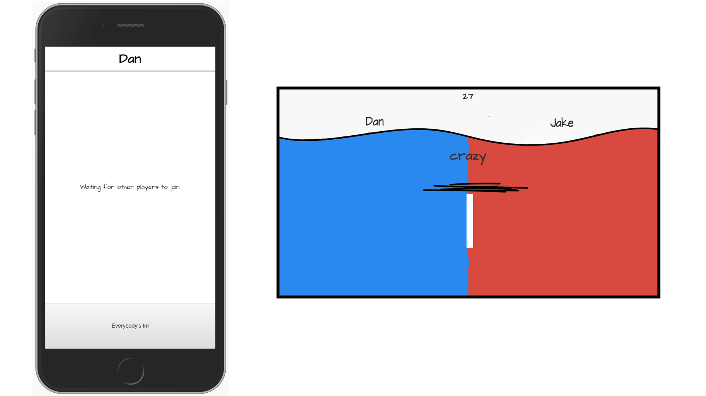

# Hackbox Backend
This is the Hackbox backend built with socket.io. It's only a mirror of what is on heroku, therefore, pushing to this will have no effect on the backend.



## The Big Picture
Hackbox is a replication of Jackbox communication methods in the form of a category guessing game. Players use their smartphone web browsers to input and vote on player submissions. The project is broken into three components: a Node.js backend, a [Web client](https://github.com/dan-singer/hackbox-web-client), and a [Unity client](https://github.com/lzhangivy/hackbox-UnityClient). The backend is hosted on Heroku, serving as a public IP to connect to. All components implement their networking protocol through Socket.io, a library used for its convenience and compatibility.

## Messages
### From Browser
**join room** - Add the socket to the room. Payload: 
```js
{
  "roomcode": "ABCD",
  "username": "user's username",
}
```
**rejoin room** - Re-add the socket to the room. Payload: 
```js
{
  "roomcode": "ABCD",
  "username": "user's username",
}
```
**everybody in** - Inform server that everybody is in. Payload:
```js
{
  "roomcode": "ABCD"
}
```
**start game** - Starts the game. Payload:
```js
{
  "roomcode": "ABCD"
}
```
**enter submission** - Informs the server of a new submission.
```js
{
  "roomcode": "ABCD",
  "player": 0 // 0 or 1
  "submission": "Submission Text"
}
```
**vote** - Sends in a vote. Payload: 
```js
{
  "roomcode": "ABCD",
  "player": 0 // 0 indicates player 1, 1 indicates player 2
}
```
## From Unity
**request room** - Requests a new room. Payload: None
**close room** - Closes the room. Payload
```js
{
  "roomcode": "ABCD"
}
```

## From Server
**timeout** - Informs clients that time is out. Payload: 
```js
{
  "winner": 0 // or 1
}
```

**time changed** - Sends the new time. Payload: 
```js
{
  "time": 59
}
```
**request room** - Returns the room code. Payload: 
```js
{
  "roomcode": "ABCD"
}
```
**everybody in** - Callback that everybody is in. Only Unity Client should care about this. Payload: None
**start game** - Returns information necessary to start the game. Payload: 
```js
{
  "category": "category_name",
  "player1Name": "Name",
  "player2Name": "Name"
}
```
**vote** - Returns the vote status. Payload: 
```js
{
  "percentage": 0 // 0 -> 1
}
```
**join room** - Returns whether or not the room was joined. Payload: 
```js
{
  "joined": true,
  "username": "playerUserName",
  "failReason": "reason for failure",
  "playerCount": 3
}
```
**rejoin room** - Re-add the socket to the room. Payload: 
```js
{
  "rejoined": true,
  "roomcode": "ABCD",
  "username": "user's username",
}
```
**enter submission** - Returns the submission that was last entered. 
```js
{
  "player": 1 // 0 or 1
  "submission": "Submission Text"
}
```

**game_error** - Returns the error that occured
```js
{
  "error": "Reason for error"
}
```

**close room** - Informs room that this room is now closed. Payload: none.